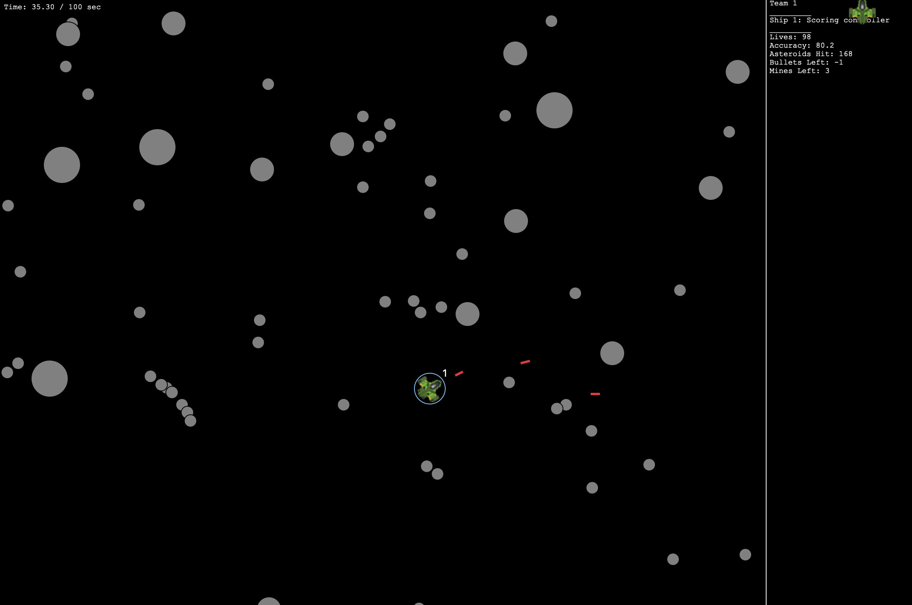
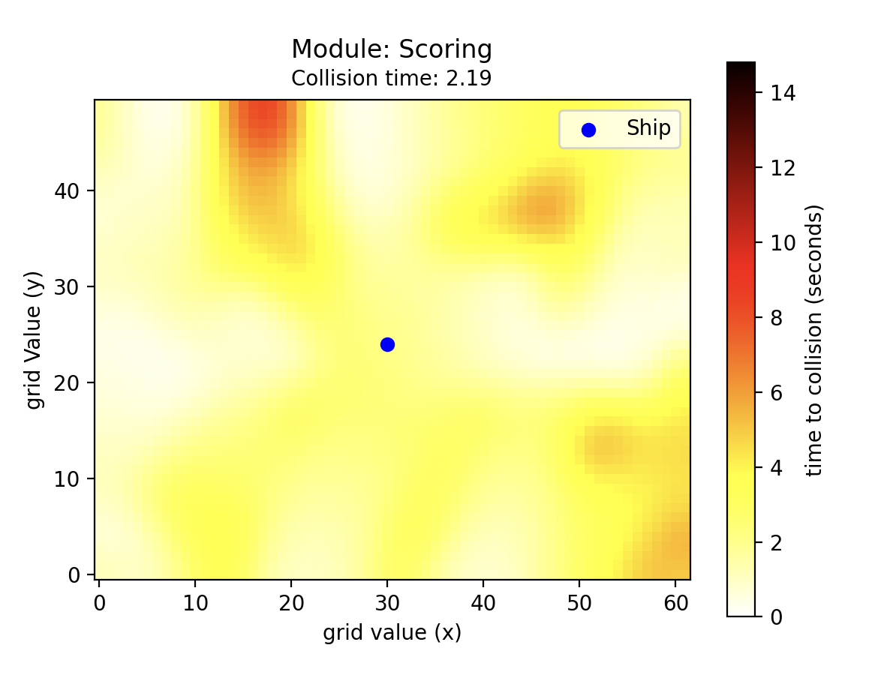

# VikingController
Contains the code for our (team SwedishVikings) AI agent submission in the 2025 Explainable Fuzzy Challenge. The kessler game files come from ThalesGroup and their kessler-game repository, some folders within kessler-game-main such as "experiments_simon" is of course our own experiments.

## How to install and run
Most important is to make sure to import the required packaged from "requirements.txt".

The controller is contained in the folder VikingAgent, within the files "RunOrShootController.py" or "RunOrShootControllerEXPLANATIONS.py" to play with or without explanations.
If you want to run the game directly from the files of this repo, run the file "combinedScenario.py".

## Images

## License
Kessler game is licensed with Apache 2, see license.txt.
